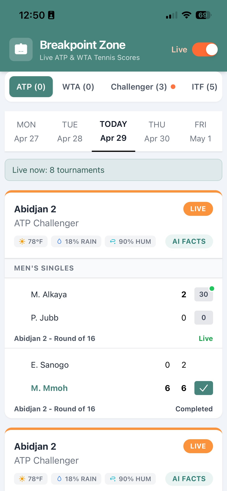
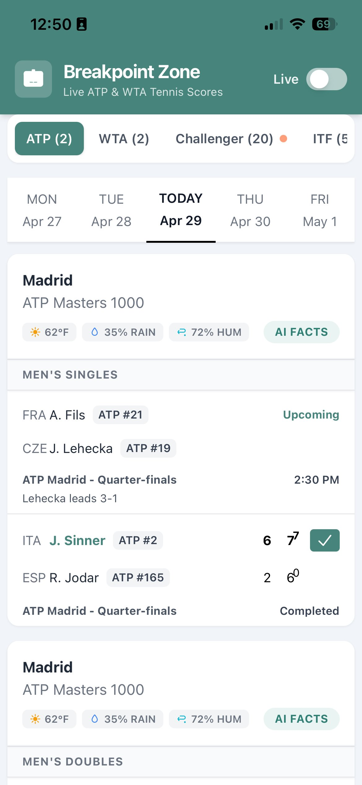

# Breakpoint Zone 🎾

> Live ATP & WTA tennis scores with tournament intelligence.

**Live:** [breakpointzone.app](https://breakpointzone.app)

---

## What it does

Breakpoint Zone is a fast, mobile-friendly web app for tennis fans to track live and scheduled matches across ATP, WTA, Challenger, and ITF tournaments — enriched with real-time weather and AI-generated tournament context.

1. **Live scores** — real-time match updates polling every ~15 seconds, no page reload needed
2. **ATP / WTA / Challenger / ITF tabs** — filter by tour with live match counts per tab
3. **Date navigation** — browse matches across the week with a simple day picker
4. **Live only toggle** — instantly filter down to matches in progress
5. **Tournament weather** — surface conditions (temperature, rain chance, humidity) shown per tournament
6. **AI Facts** — Gemini-powered fun facts and tournament history surfaced per event
7. **Tournament info panel** — category, location, surface, current champion, overview, and notable winners

---

## Screenshots

### Live Scores


### Today's Schedule


### Tournament Info


### AI Fun Facts


---

## Tech stack

| Layer | Technology |
|-------|-----------|
| **Frontend** | React · Vite · TypeScript · Tailwind CSS |
| **Backend** | Node.js · Express · Vercel Serverless Functions |
| **Database** | Supabase (Postgres, RLS-protected facts storage) |
| **AI** | Google Gemini (tournament fun facts generation) |
| **Automation** | n8n (async facts enrichment pipeline) |
| **Weather** | SerpAPI (real-time tournament location weather) |
| **Payments** | Stripe (donation flow via payment links) |

---

## How it works

```
User opens app
      │
      ▼
Scores fetched & rendered progressively by tournament
      │
      ▼
Live matches polled every ~15s for score updates
      │
      ├── Weather API → per-tournament conditions (5min cache)
      │
      └── AI Facts pipeline:
            Enqueue job → n8n worker → Gemini generates facts
            → signed callback → Supabase → frontend reads
```

---

## Key features

- **Progressive rendering** — tournaments appear as data loads, no all-at-once blocking
- **Live delta updates** — only active matches re-fetch, keeping the UI snappy
- **Async facts pipeline** — AI enrichment runs in the background with retry/requeue support
- **Graceful degradation** — weather and facts failures never break the core score experience
- **Secure internals** — HMAC-verified callbacks, server-side-only Supabase service keys, token-gated admin routes

---

## Status

🟢 Live and actively maintained.

---

## Note on source code

This is a private project. Source code is not publicly available.
For questions or collaboration inquiries, feel free to [open an issue](../../issues) or reach out directly.

---

## Author

**Beni Goldenberg** · [github.com/bgoldenberg](https://github.com/bgoldenberg)
