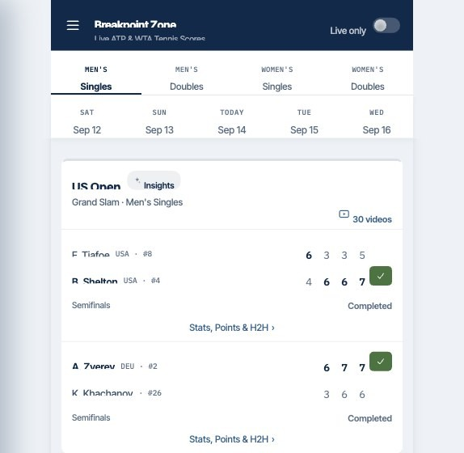
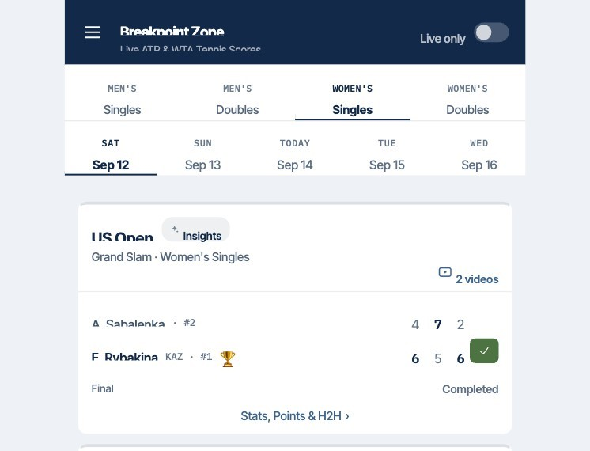
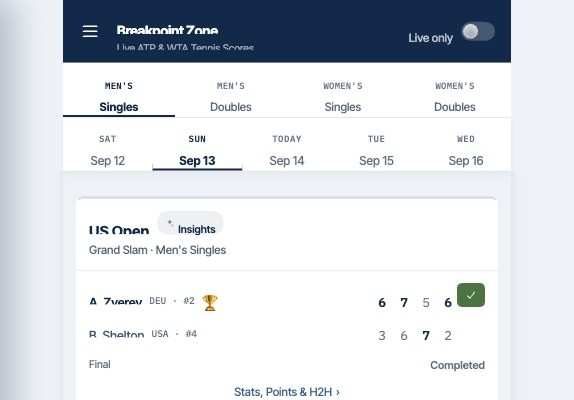
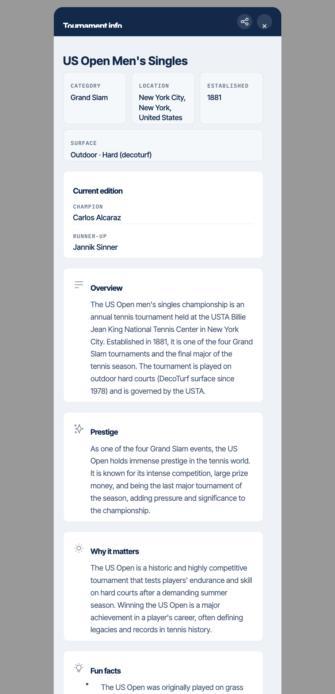
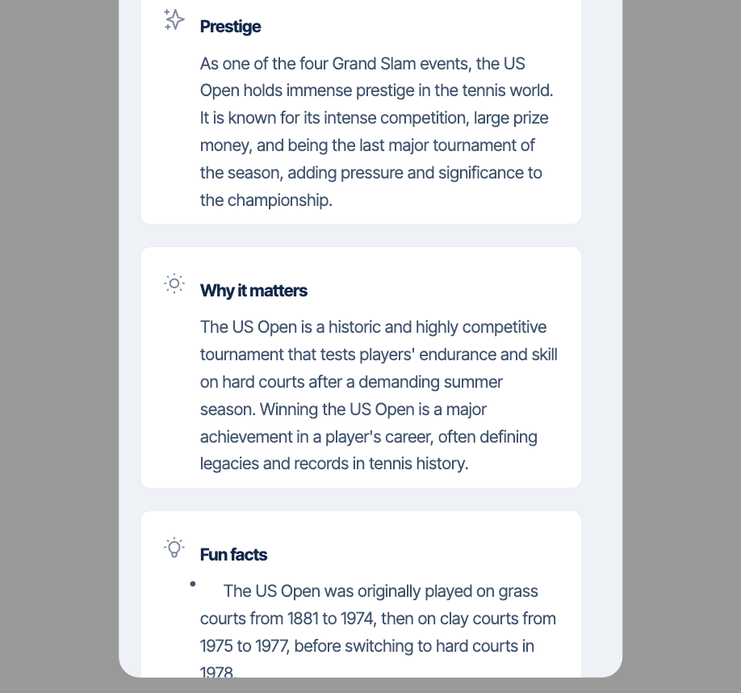
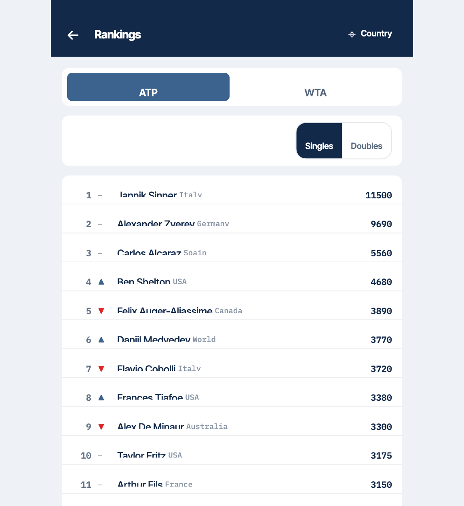
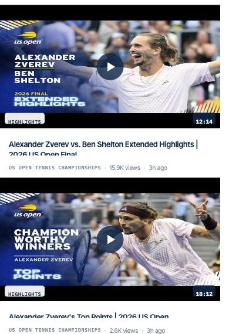

# Breakpoint Zone 🎾

> Live ATP & WTA tennis scores with tournament intelligence — now with a Chrome extension, live rankings, and match highlights.

**Live:** [breakpoint.zone](https://breakpoint.zone)

---

## What it does

Breakpoint Zone is a fast, mobile-friendly web app (and Chrome extension) for tennis fans to track live and scheduled matches across ATP, WTA, Challenger, and ITF tournaments — enriched with real-time weather, AI-generated tournament context, video highlights, and world rankings.

1. **Live scores** — real-time match updates polling every ~15 seconds, no page reload needed
2. **Draw-based tabs** — Men's / Women's Singles & Doubles at a glance, with ATP / WTA / Challenger / ITF tier filtering
3. **Date navigation** — browse matches across the week with a simple day picker
4. **Live only toggle** — instantly filter down to matches in progress
5. **Stream Sync** — hold live scores back 5–60 seconds so they don't spoil a delayed TV or stream broadcast
6. **Match Highlights** — video highlight counts on every match card, plus a dedicated highlights feed
7. **Rankings** — live ATP & WTA singles and doubles rankings, with movement indicators and country filtering
8. **Tournament weather** — real-time conditions (temperature, rain chance, humidity) shown per tournament
9. **AI Facts** — AI-generated fun facts and tournament history surfaced per event
10. **Tournament info panel** — category, location, surface, current champion, overview, and notable winners
11. **Chrome extension** — the full live-scores experience in a side panel, one click away in your browser

---

## Screenshots

### Live Scores — Fri, Sept 11 (Semifinals)


### Live Scores — Sat, Sept 12 (Women's Final)


### Live Scores — Sun, Sept 13 (Men's Final)


### Tournament Info


### AI Fun Facts


### Rankings 🆕


### Match Highlights 🆕


---

## Tech stack

| Layer | Technology |
|-------|-----------|
| **Frontend** | React · Vite · TypeScript · Tailwind CSS |
| **Browser extension** | Chrome Manifest V3 side panel (`@crxjs/vite-plugin`), sharing the website's codebase |
| **Backend** | Node.js · Express · Vercel Serverless Functions |
| **Database** | Supabase (Postgres, RLS-protected facts & rankings storage) |
| **Live data** | api-tennis.com (scores, standings) |
| **AI** | OpenAI (structured JSON tournament fun-facts generation) |
| **Automation** | n8n (async facts enrichment + weekly doubles-rankings scrape) |
| **Weather** | SerpAPI (real-time tournament location weather) |
| **Payments** | Stripe (donation flow via payment links) |

---

## How it works

```
User opens app (web or Chrome side panel)
      │
      ▼
Scores fetched & rendered progressively by tournament
      │
      ▼
Live matches polled every ~15s for score updates (optionally delayed via Stream Sync)
      │
      ├── Weather API → per-tournament conditions (5min cache)
      │
      ├── Rankings → api-tennis.com (singles) + weekly n8n scrape (doubles) → Supabase
      │
      ├── Highlights → per-match video counts + dedicated highlights feed
      │
      └── AI Facts pipeline:
            Enqueue job → n8n worker → OpenAI generates facts
            → signed callback → Supabase → frontend reads
```

---

## Key features

- **Progressive rendering** — tournaments appear as data loads, no all-at-once blocking
- **Live delta updates** — only active matches re-fetch, keeping the UI snappy
- **Stream Sync** — deliberately delayed scores so live coverage never spoils a broadcast you're behind on
- **Async facts pipeline** — AI enrichment runs in the background with retry/requeue support
- **Graceful degradation** — weather, facts, and highlights failures never break the core score experience
- **Secure internals** — HMAC-verified callbacks, server-side-only Supabase service keys, token-gated admin routes
- **One codebase, two surfaces** — the Chrome extension reuses the website's components, hooks, and services

---

## Status

🟢 Live and actively maintained.

---

## Note on source code

This is a private project. Source code is not publicly available.
For questions or collaboration inquiries, feel free to [open an issue](../../issues) or reach out directly.

---

## Author

**Beni Goldenberg** · [github.com/bgoldenberg](https://github.com/bgoldenberg)
